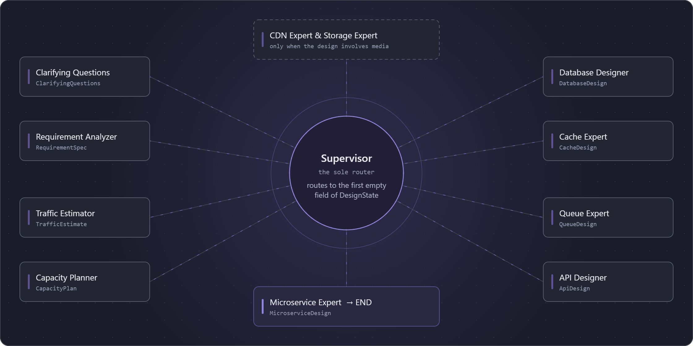

# AI System Design Consultant

Turn **"design Instagram"** into a full system design document — locally, with no API keys.

[](./LICENSE)
[](https://www.python.org/downloads/)
[](https://www.langchain.com/langgraph)
[](https://ollama.com)

A [LangGraph](https://www.langchain.com/langgraph) supervisor-and-worker app that runs an automated system-design interview. You give it a prompt; a supervisor node routes a shared design state through a chain of specialist agents — clarifying questions, requirements, traffic estimation, capacity planning, database/cache/queue/CDN/storage, API design, microservices — each producing a typed artifact, until the document is assembled.

Every agent shares one local model served by [Ollama](https://ollama.com). Nothing leaves your machine.

---

## What you get

<!--
Replace this section with output from a real run — trimmed, but real.
A short asciinema/vhs recording of a POST /design/start plus the resulting
doc will do more for this README than everything below it.
-->

```
$ curl -s localhost:8000/design/start \
    -H 'content-type: application/json' \
    -d '{"user_query": "Design a system like Instagram"}'
```

The run pauses on clarifying questions, then fills in a `DesignState` artifact by artifact:

```
requirements       ✓  functional / non-functional, in/out of scope
traffic_estimate   ✓  DAU, read:write ratio, peak QPS
capacity_plan      ✓  storage/bandwidth per year, server count
database_design    ✓  engine choice + rationale, schema, sharding key
cache_design       ✓  what's cached, eviction, invalidation
queue_design       ✓  async boundaries, topics, delivery guarantees
cdn_design         ✓  what's edge-cached, TTLs
api_design         ✓  endpoints, request/response shapes
microservices      ✓  service boundaries and their dependencies
```

Because each agent is forced into a Pydantic schema, the result is structured data you can render, diff, or export — not a wall of prose.

## Why this exists

System design interviews and real architecture reviews follow a repeatable shape: clarify, estimate scale, pick a data model, work through caching/queues/CDN, sketch the API, then the services. Most LLM wrappers try to do that in one giant prompt and produce something shallow.

This models it as what it actually is — a pipeline of specialists handing off a shared state, each one narrow and typed — and runs on a local model, so experimenting is free and your design questions stay on your hardware.

## How it works



- A `StateGraph` (`app/grpahs/supervisor_graph.py`) holds a shared `DesignState` (`app/state/desgin_state.py`).
- `supervisor` (`app/agents/supervisor.py`) is the sole router. It inspects which fields of the state are still empty and dispatches the next specialist.
- Every specialist (`app/agents/*.py`) has the same shape: build a prompt from state → bind tools (e.g. a sandboxed calculator) → run a capped tool-calling loop → force a Pydantic-typed structured output → return control to the supervisor.
- Agents never call each other. Every transition goes back through the supervisor, so the routing logic lives in exactly one place.
- System prompts are versioned per agent under `app/prompts/<agent_name>/v1.py`.

[`CLAUDE.md`](./CLAUDE.md) has the full architectural notes — including two intentional misspellings in module paths that the rest of the code imports. Don't "fix" those without updating every import.

## Quickstart

**Prerequisites:** Python 3.12+, [uv](https://docs.astral.sh/uv/), and [Ollama](https://ollama.com) running locally.

```bash
ollama pull qwen2.5:3b

git clone https://github.com/deepanshu2711/AI-System-Design-Consultant.git
cd AI-System-Design-Consultant
uv sync
cp .env.example .env        # optional: LangSmith tracing keys

uv run fastapi dev app/main.py
```

### API

**`POST /design/start`** — kick off a run.

```bash
curl -s localhost:8000/design/start \
  -H 'content-type: application/json' \
  -d '{"user_query": "Design a system like Instagram"}'
```

If the graph interrupts for clarification, the response carries a `thread_id` and the questions.

**`POST /design/resume`** — answer them and continue.

```bash
curl -s localhost:8000/design/resume \
  -H 'content-type: application/json' \
  -d '{"thread_id": "<from /design/start>", "answers": {"expected_dau": "50M"}}'
```

Checkpointing is in-memory (`MemorySaver`), so state does not survive a process restart.

### Configuration

| Variable | Default | Notes |
| --- | --- | --- |
| `OLLAMA_MODEL` | `qwen2.5:3b` | Must be a model with tool-calling support. |

See `.env.example` for the optional LangSmith tracing variables.

## A note on model size

`qwen2.5:3b` is the default because it runs on a laptop, not because it writes the best documents. At 3B the pipeline works end to end, but the reasoning inside each artifact is thin — capacity numbers get hand-wavy and service boundaries get generic. If you have the memory, `qwen2.5:7b` or larger is a noticeably different experience for the same code. Tool calling is a hard requirement, so text-only models won't work.

## Status

Active work in progress, not a finished product. The main gap: **there is no automated test suite yet**, so changes need to be verified by hand against a running instance. Other known gaps live in [`TODO.md`](./TODO.md) and the [issues](../../issues).

Want to help? [`good first issue`](../../issues?q=is%3Aissue+is%3Aopen+label%3A%22good+first+issue%22) is the place to start.

## Roadmap

- [ ] Automated test suite
- [ ] Persistent checkpointing (swap `MemorySaver` for a durable store)
- [ ] Export the assembled design doc to Markdown/PDF
- [ ] Architecture review pass over the completed document

Full list in [`TODO.md`](./TODO.md).

## Contributing

See [`CONTRIBUTING.md`](./CONTRIBUTING.md) for local setup and conventions. If you build something with this or find it useful, a star helps others find it.

## License

[MIT](./LICENSE)
